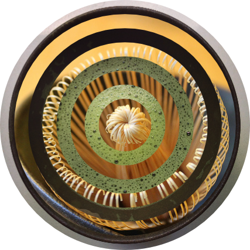
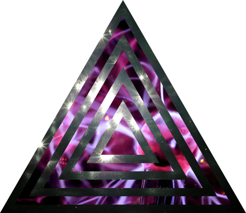

# cairobou
Command line tool to create remixes of given images.

## Info
* It's not working very robustly if the given images have big differences in size.
* You can generate PDFs by using the -o option and use the extension '.pdf' for the output file.
## Quick start
	Usage: cairobou.py [options] images*

	Options:
	  -h, --help         show this help message and exit
	  -o OUT, --out=OUT  specify output file
	  -g GAP, --gap=GAP  difference between the images
	  -v, --verbose      print status messages to stdout
	  -d, --debug        print status and debug messages to stdout

